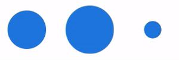
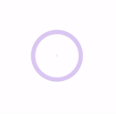
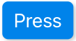

# React Components

This library provides a list of useful components for React projects

## Install

To install the library, run this command:

```sh
npm install @gerrico/react-components
```

## Index

- [React Components](#react-components)
  - [Install](#install)
  - [Index](#index)
  - [Selector](#selector)
    - [Props](#props)
    - [Example](#example)
  - [BubbleLoader](#bubbleloader)
    - [Props](#props-1)
    - [Example](#example-1)
  - [BounceLoader](#bounceloader)
    - [Props](#props-2)
    - [Example](#example-2)
  - [RadarLoader](#radarloader)
    - [Props](#props-3)
    - [Example](#example-3)
  - [Button](#button)
    - [Props](#props-4)
    - [Example](#example-4)

## Selector

A button to toggle between states.


### Props

| Name       | Description                                               | Type     | Required | Default   |
| ---------- | --------------------------------------------------------- | -------- | -------- | --------- |
| id         | Unique id for the component                               | string   | Yes      |           |
| status     | The status of the selector (false -> left, true -> right) | boolean  | Yes      |           |
| onClick    | Action to perform                                         | function | Yes      |           |
| colorOff?  | The color of the selector while is **off**                | string   | No       | #444      |
| colorOff?  | The color of the selector while is **on**                 | string   | No       | #444      |
| textColor? | The color of the text inside the selector                 | string   | No       | #FFF      |
| disabled?  | If true, the selector is disabled                         | boolean  | No       | false     |
| className? | Provide other style                                       | string   | No       | undefined |

### Example

```Javascript
import React, { useState } from "react";
import { Selector } from "@gerrico/react-components";

const App = () => {
  const [status, setStatus] = useState(false);

  return (
    <div>
      <Selector
        id="selector"
        status={status}
        onClick={() => {
          setStatus(!status);
        }}
        items={["OFF", "ON"]}
        colorOff="#2080B0"
        colorOn="#20B080"
      />
    </div>
  );
}

export default App;
```

## BubbleLoader

A loader with twelve bubbles that increase and decrease their size.


### Props

| Name        | Description                                                            | Type   | Required | Default   |
| ----------- | ---------------------------------------------------------------------- | ------ | -------- | --------- |
| left?       | Set the distance from the left margin                                  | string | No       | 50%       |
| top?        | Set the distance from the top margin                                   | string | No       | 50%       |
| bubbleSize? | Set the size of the bubbles (the size of the component doesn't change) | number | No       | 1         |
| color?      | The color of the bubbles                                               | string | No       | #DDD      |
| className?  | Provide other style                                                    | string | No       | undefined |

### Example

```Javascript
import React from "react";
import { BubbleLoader } from "./components";

const App = () => {
  return (
    <div>
      <BubbleLoader left="50vw" top="50vh" color="#20E080" />
    </div>
  );
};

export default App;
```

## BounceLoader

A loader with three bouncing balls.



### Props

| Name       | Description                           | Type   | Required | Default   |
| ---------- | ------------------------------------- | ------ | -------- | --------- |
| left?      | Set the distance from the left margin | string | No       | 50%       |
| top?       | Set the distance from the top margin  | string | No       | 50%       |
| size?      | A multiplying factor for balls size   | number | No       | 1         |
| color?     | The color of the balls                | string | No       | #DDD      |
| className? | Provide other style                   | string | No       | undefined |

### Example

```Javascript
import React from "react";
import { BounceLoader } from "./components";

const App = () => {
  return (
    <div>
      <BounceLoader left="50vw" top="50vh" color="#2080E0" size={0.8}/>
    </div>
  );
};

export default App;
```

## RadarLoader

A loader that simulates a radar signal



### Props

| Name       | Description                                       | Type    | Required | Default   |
| ---------- | ------------------------------------------------- | ------- | -------- | --------- |
| left?      | Set the distance from the left margin             | string  | No       | 50%       |
| top?       | Set the distance from the top margin              | string  | No       | 50%       |
| size?      | A multiplying factor for radar size               | number  | No       | 1         |
| color?     | The color of the radar                            | string  | No       | #be97e8   |
| fill?      | Only border (if false) or entire circle (if true) | boolean | No       | false     |
| className? | Provide other style                               | string  | No       | undefined |

### Example

```Javascript
import React from "react";
import { RadarLoader } from "./components";

const App = () => {
  return (
    <div>
      <RadarLoader left="50vw" top="62vh" size={1} fill={false} />
    </div>
  );
};

export default App;
```

## Button

A simple button with background color selection and automatic text color.



### Props

| Name       | Description                                                                                         | Type    | Required | Default   |
| ---------- | --------------------------------------------------------------------------------------------------- | ------- | -------- | --------- |
| onClick    | Action performed after clicking it                                                                  | string  | Yes      |           |
| color      | Background color for the button (text color is always black or white, based on the background color | string  | No       | #2090F0   |
| disabled?  | If true, the button is disabled                                                                     | boolean | No       | false     |
| className? | Provide other style                                                                                 | string  | No       | undefined |

ATTENTION: currently, the `color` prop must be in hex format (#RRGGBB). This is due to the calculation of the text color. In future, there will be the possibility to set the color by:

- picking it from a list of standard colors (_primary_, _info_, _warning_, _danger_, etc.)
- writing the exact color (`red`, `blue`, `green`, etc.)
- by entering the color coding (_rgb_, _hsl_, etc.)

### Example

```Javascript
import React from "react";
import { RadarLoader } from "./components";

const App = () => {
  return (
    <div>
      <Button onClick={() => alert("Pressed!")}>Press Me!</Button>
    </div>
  );
};

export default App;
```
